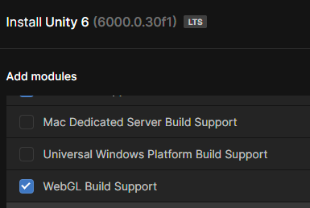
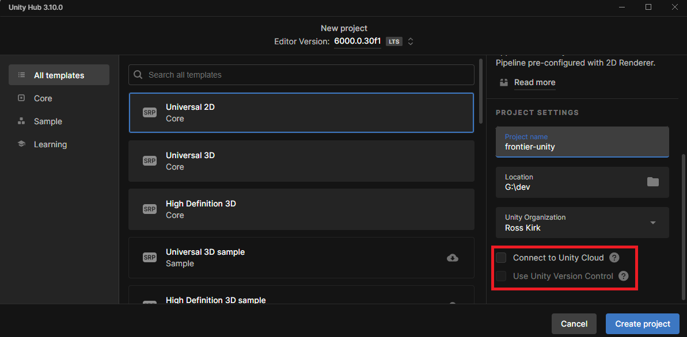
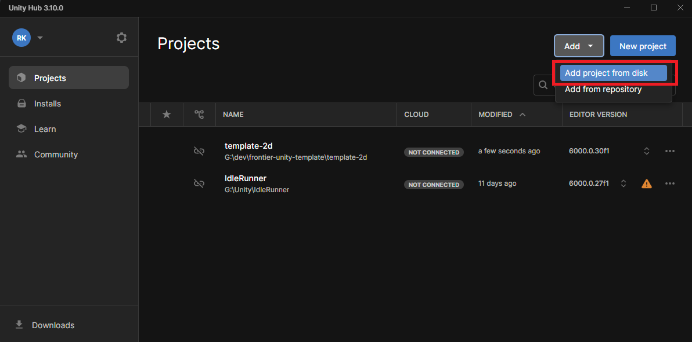
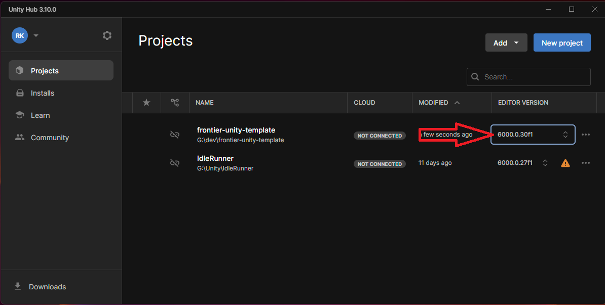
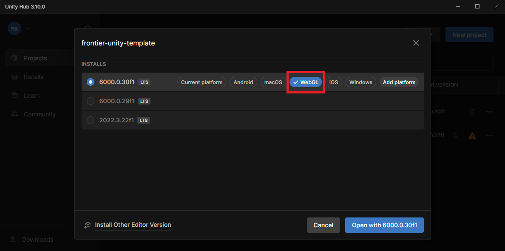

# Getting Started with Unity
This project will contain a standard project structure to use as a basis for 2D projects specifically, but it is simple to change to 3D in the project later down the line.

No standard assets will be included outside of the pre-defined imported Unity Packages for this version of the engine, but some demo assets for guidance/best practice will be included.

## Installing Unity
The current LTS of Unity at time of writing (05/12/2024) is [6000.0.30f1](https://unity.com/releases/editor/archive), and will be used as the basis for the project template. 

Install with the **WebGL Build Support** option using the Unity Hub, as it is easier to manage module/platform updates using the hub:

## Creating Projects
Creating a new project in the hub is simple. Choose the template you want to use from the defaults, making sure to only use the Core options (Univeral 2D Core is a good start). 

> [!NOTE]
> Make sure to **uncheck** the option to Connect to Unity Cloud, as this links your project to a new unity cloud project (which creates & links analytics & such if you have those services on your licence):
 

## Adding Projects
As we're not using Unity VCS, we won't be adding projects from the repository option. Check out the project you need from the relevant source (Github for example), then add it as shown here:

## Opening Projects
I know opening a project sounds simple, but with Unity you can end up with issues & long wait times between domain reloading/script compilation/asset imports if you have to switch platform while your project is already open.

Always open your project from the hub using the relevant engine version & intended platform to avoid issues with compatibility etc. For our use cases of WebGL, we want to open the project by clicking here:

Then in the following screen, select the relevant platform & version & hit open:

> [!NOTE]
> This only applies if the project hasn't been saved with the correct intended active platform, as current platform is the defaul selection here. This should be correct on most working projects, just something to be aware of when opening!  